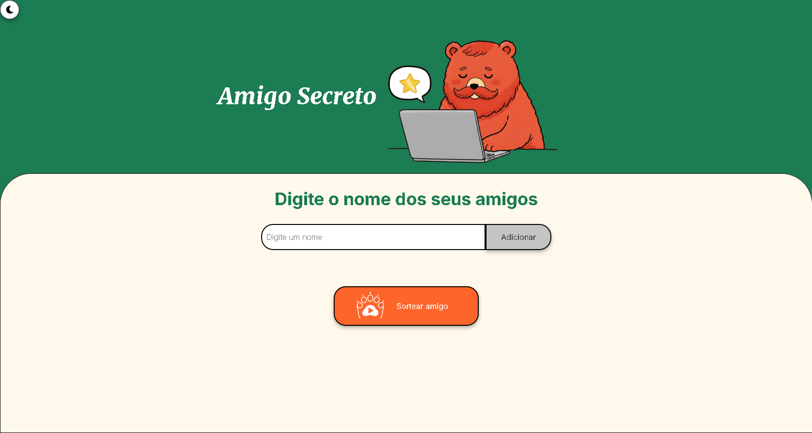

# Amigo Secreto

Este projeto é uma aplicação simples de "Amigo Secreto" que permite aos usuários adicionar amigos a uma lista e sortear um amigo aleatoriamente. O objetivo principal é fortalecer as habilidades em lógica de programação e manipulação de DOM. Este desafio faz parte do programa ONE (Oracle Next Education), através da plataforma da Alura, que visa capacitar estudantes em tecnologia.



## Funcionalidades

- Adicionar amigos à lista.
- Verificar se o nome já foi adicionado.
- Sortear um amigo aleatoriamente da lista.
- Exibir mensagens de alerta para feedback ao usuário.

## Tecnologias Utilizadas

<div>
  
  
  
  
</div>

## Como usar

Acesse e teste o projeto [**clicando Aqui!**](https://christian-rui.github.io/amigo-secreto-ONE/)

1. **Adicionar Amigos:**
   Digite o nome do amigo no campo de entrada e clique no botão para adicionar.
   Se o nome já estiver na lista, uma mensagem de alerta será exibida.

2. **Sortear Amigo:**
   Após adicionar pelo menos dois amigos, clique no botão para sortear um amigo.
   O nome do amigo sorteado será exibido na tela.

## Principais Técnicas Utilizadas

- **Manipulação do DOM**: Utilização de métodos como `document.getElementById()` e `innerHTML` para interagir com os elementos da página e atualizar a interface do usuário dinamicamente.
- **Validação de Entrada**: Implementação de verificações para garantir que os nomes adicionados não sejam vazios ou duplicados, melhorando a experiência do usuário.

- **Funções de Callback**: Uso de funções como `setTimeout` para controlar a exibição de mensagens de alerta, permitindo que o usuário receba feedback visual temporário.

- **Estrutura Modular**: Organização do código em funções específicas, facilitando a leitura, manutenção e reutilização do código.

- **Uso de Arrays**: Armazenamento dos nomes dos amigos em um array, permitindo fácil manipulação e acesso aos dados.

- **Controle de Estado**: Implementação de um objeto para gerenciar o estado das mensagens de alerta, evitando que múltiplos alertas sejam exibidos simultaneamente.

## Estrutura do Projeto

`index.html`: O arquivo HTML principal que contém a estrutura da página.

`style.css`: O arquivo CSS para estilização da interface.

`script.js`: O arquivo JavaScript que contém a lógica do aplicativo.

## Como Modificar o Projeto

**Clone o repositório**:

```bash
git clone https://github.com/Christian-Rui/amigo-secreto-ONE.git
cd amigo-secreto-ONE
```

# Time

| [<br><sub>Bearly</sub>](https://github.com/Christian-Rui)
| :---: |
